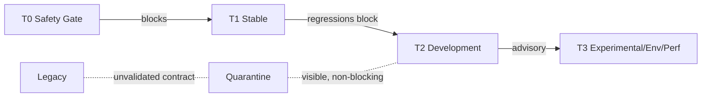

# Development Convergence Mode

Development Convergence Mode gives the suite a test **authority system**: it
separates blocking evidence from advisory evidence so the repository can converge
to green without pretending the current 16250-item suite is healthy.

The baseline at `a7391335cdfb5e5c0471a37a432075d739b6e7df` shows 38 failed +
2 errors in one functional cluster, CI runners that contradict each other, and
zero `xfail` signal. There is no single runner that represents the suite's real
state. This model defines what that state is, tier by tier.

**State discipline**: only PASS / PARTIAL / FAIL / NOT_TESTED / BLOCKED are
honest states. No "fully stabilized" claims anywhere.

## The tiers

| Tier | Name | Blocks merge? | Meaning |
|---|---|---|---|
| T0 | Safety Gate | **YES** | Tiny, deterministic smoke set: app boots, DB opens, core services construct, navigation works. Must pass before any merge. |
| T1 | Stable | **YES** (regressions) | Conservative regression set: deterministic, fast, no environment dependence. A change that regresses T1 blocks. |
| T2 | Development | No (advisory) | In-progress tests for features under development. Informative; expected to churn with the feature. |
| T3 | Experimental / Environmental / Performance | No (manual) | Perf, hardware, audio, visual, network-dependent tests. Run manually or on demand. |
| Quarantine | — | No | Failing or broken tests moved out of the gates but **visible** in a register, with an explicit rehabilitation obligation. |
| Legacy | — | No | Tests whose contract is unvalidated (e.g. decommission dirs, perf leftovers). Awaiting KEEP/REWRITE/QUARANTINE/DELETE. |

## T0 Safety Gate: exact contents

T0 blocks every merge, so its membership is explicit and small. It has two
parts:

1. **Script gates already in the repository**, run at merge time:

   - `ruff check .` — zero lint violations
   - `python -m compileall -q .` — clean compile check
   - `scripts/check_single_authority.py`
   - `scripts/qml_only_gate.py`
   - `scripts/check_patch_artifacts.py`
   - `scripts/smoke_composition.py`

2. **Curated pytest gate set** — a small, deterministic, contract-critical set
   marked `@pytest.mark.gate`. The exact membership is materialized in PR-B,
   with CI enforcement in PR-C; candidate files:

   | Candidate file | Contract |
   |---|---|
   | `tests/architecture/test_service_manifest_complete.py` | service manifest completeness |
   | `tests/architecture/test_all_managed_services_shutdown_once.py` | container shutdown-once |
   | `tests/test_crash_reporter.py` | crash reporter |
   | `tests/test_core_paths.py` | XDG paths consolidation |
   | `tests/test_database_clean.py` | library DB WAL + FTS5 availability |
   | `tests/test_search_filters_fuzzer.py` | search FTS5 field-filter sanitization |

   The set is capped at roughly 15–25 tests chosen from these files: enough to
   prove app boot, DB open, core service construction, and navigation without
   letting environment dependence into the blocking gate.

## What blocks, what is advisory

- **Blocks**: T0 failures, T1 regressions introduced by a change.
- **Advisory**: T2 results inform the checkpoint; they never block by themselves.
- **Manual**: T3 is only meaningful when run deliberately; missing T3 green is
  not a merge blocker.
- **Quarantine and Legacy**: never part of a gate command; their entries exist
  so the failure is accounted for, not hidden.

## Quarantine meaning

Quarantine is **visible, non-blocking, and time-bounded by obligation**:

1. The test stays in the repo and in a register (see the
   [baseline](TEST_AUTHORITY_BASELINE.md#provisional-per-directory-classification-proposed-not-implemented)
   for the PROPOSED starting entries).
2. It is excluded from gate commands (PR-B/PR-C scope).
3. It cannot be ignored forever: every quarantined test must be triaged through
   the rehabilitation process below within 2 release cycles or 30 days,
   whichever comes first. The triage is recorded in
   `docs/testing/TEST_AUTHORITY_MIGRATION_REPORT.md`; the accountable owner is
   the maintainer/orchestrator.
4. Quarantine is a state, not a shelf: entries without a planned outcome are
   Legacy by default.

## Rehabilitation process: KEEP / REWRITE / QUARANTINE / DELETE

Every red or suspected-broken test goes through exactly one decision.

| Decision | Apply when | Resulting tier |
|---|---|---|
| **KEEP** | Test is correct, deterministic, fast; failure is a real product bug | Fix the product bug; test stays T1/T2 |
| **REWRITE** | Test intent is valid but the test is broken (missing helper, wrong fixture, duplicated class) | Rewrite it; it returns as T1/T2 candidate |
| **QUARANTINE** | Test is red and can't be triaged in this work unit | Register it; non-blocking; rehabilitation obligation remains |
| **DELETE** | Contract is dead or unvalidated (decommission, legacy, duplicate coverage) | Remove it; the decision is documented |

Rules of the process:

- A decision must state evidence (failure output, contract it checks, duplicate coverage).
- No silent KEEP: a test that keeps failing is either REWRITE or QUARANTINE.
- No silent DELETE of a red test: delete only with documented contract assessment.
- "Tests are evidence, not specification": a test does not define the product;
  it records behavior you verified. When product and test disagree, the product
  decision belongs to the architecture checkpoint, not to the test.

## Promotion workflow: development → stable

T2 → T1 (and T1 staying stable) requires evidence:

1. Until PR-C reconciles the CI runners (the baseline's runner inventory
   records them as contradictory), promotion requires two independent local
   runs on different interpreters or machines — e.g. Python 3.11 and Python
   3.12. After PR-C lands, one local run plus one CI run qualifies. A single
   green run is NOT stable evidence — see the baseline's `tests/qml/functional`
   note.
2. No environment heuristics in the critical path (no `os.environ` gates,
   no `QT_QPA_PLATFORM`-dependent assertions, no subprocess dependence) —
   audit against the baseline's heuristic counts. The criterion applies to the
   tests being promoted, not as a blanket rejection of the existing suite:
   environment-dependent tests must be quarantined or made deterministic
   before their cluster can be promoted.
3. Zero `xfail` and zero `DID NOT RAISE` in the cluster.
4. The promotion is recorded in the baseline's next revision (update the
   per-directory classification and the maturity file).

Quarantine → T1 is the same path, starting at step 1.

## Acting on failing legacy tests

Legacy tests are unvalidated contracts, not bugs. Before touching one:

1. Read the baseline register: is this cluster already classified?
2. Triage with KEEP / REWRITE / QUARANTINE / DELETE — never edit assertions to
   make it pass (that is test appeasement, see
   [AI Development Policy](../development/AI_DEVELOPMENT_POLICY.md)).
3. If the fix is small and the contract is real, fix forward; if not, quarantine
   it and move on. One failing legacy test is not a reason to stall a work unit.

## Adding tests for new features

1. Follow `WRITING_TESTS.md` for placement and naming.
2. New tests ship in the same work unit as the code they verify.
3. Default tier is T2 (advisory) until promoted; a new feature never weakens the
   T0 or T1 gates.
4. The test must run without environment gates at T2 level; environment-dependent
   checks go to T3 explicitly.
5. Declare intent in the baseline's next revision if the new tests change a
   directory's classification.

## Prohibitions

- No new red tests without a quarantine entry or an explicit T3 designation.
- No test appeasement (weakening or deleting assertions to go green).
- No silent reclassification; every class change is a documented decision.
- No "fully stabilized" claims; PASS/PARTIAL/FAIL/NOT_TESTED/BLOCKED only.
- Enforcement (marker registration, gate commands, CI wiring) is implemented in
  PR-B/PR-C; this document defines policy, not current enforcement.
- No editing a test to describe what you wish the product were, instead of what
  the product does.

## Related documents

- [Test Authority Baseline](TEST_AUTHORITY_BASELINE.md) — audited numbers, clusters, PROPOSED classifications.
- [Testing index](README.md) — how to run each level.
- [Subsystem Maturity](SUBSYSTEM_MATURITY.yaml) — per-subsystem maturity declarations.
- [AI Development Policy](../development/AI_DEVELOPMENT_POLICY.md) — how AI agents change tests (26A).
